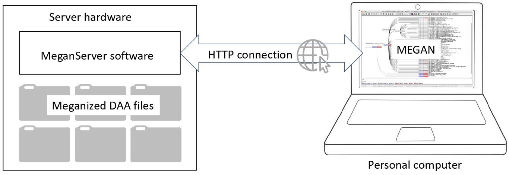

# MeganServer

<i>MeganServer</i>: facilitating interactive access to metagenomic data on a server.

## Availability: 

MeganServer is provided as a standalone program <i>tools/megan-server</i> in the Megan6 software suite. MEGAN6 can be downloaded from the  <a href="http://software-ab.cs.uni-tuebingen.de/download/megan6/welcome.html"><b>MEGAN6 Download Page</b></a> 

## Manual

<b>MeganServer Manual:</b> Details on how to install and get started can be found in manual: https://software-ab.cs.uni-tuebingen.de/download/megan6/User_Manual_for_MeganServer.pdf

## The MeganServer workflow

we present <i>megan-server</i>, a program that can serve files that are hosted on a server to instances of MEGAN running on personal computers, over the web. This uses a lightweight Representational State Transfer-Application Programming Interface (<i>REST-API</i>)-based framework 
written in Java.
This allows researchers to analyze files produced by the DIAMOND+MEGAN pipeline on their local computer, without any need to download data from a server directory.

Data is sent and received via REST which makes reuse of HTTP technology. While users can access the files using a web browser, they will usually access the files via the MEGAN, which acts as a client and communicates with instances of MeganServer. More details can be found in Publication
  

##  Support for MeganServer

If you have any queries/questions regarding installation, usage, or want us to include new features, etc of  MeganServer, please use the <a href="http://megan.cs.uni-tuebingen.de/">MEGAN community</a> website to post them
 

## Publication 

- Anupam Gautam, Wenhaun Zeng, and Daniel H Huson. <i>MeganServer</i>: facilitating interactive access to metagenomic data on a server. *Bioinformatics*, 39(3), 02 2023. btad105. https://doi.org/10.1093/bioinformatics/btad105
